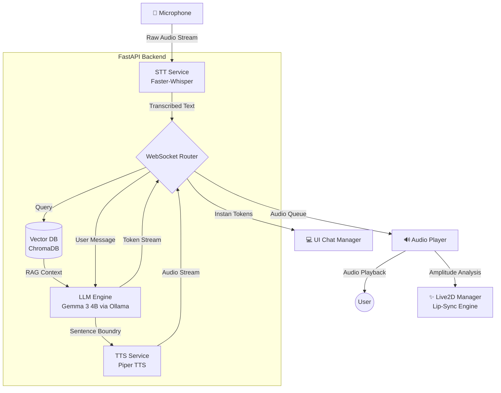

# Rei Project: Gemma-Aura 🌸

Rei Project adalah asisten AI virtual berbasis desktop yang ditenagai oleh model bahasa **Gemma 3** (melalui Ollama), lengkap dengan integrasi **Live2D** untuk visualisasi karakter, **STT (Speech-to-Text)** untuk input suara, dan **TTS (Text-to-Speech)** untuk output suara. Sistem ini dibangun dengan fokus pada latensi rendah (*True Token Streaming*) dan dilengkapi sistem memori berkelanjutan (*Long-Term Memory*).

## 🚀 Fitur Utama

- **Visual Karakter Live2D**: Animasi karakter "Rei" yang responsif dengan sinkronisasi bibir (*lip-sync*) otomatis dan perubahan ekspresi berdasarkan konteks pembicaraan.
- **Local AI (Gemma 3)**: Pemrosesan bahasa 100% berjalan secara lokal menggunakan Ollama, menjamin privasi penuh.
- **Contextual Memory & RAG**: Kemampuan *Long-Term Memory* dan RAG menggunakan **ChromaDB**. Rei dapat mengingat fakta spesifik tentang Anda atau mengambil data dari kumpulan dokumen lokal Anda di folder `knowledge/`.
- **True Token Streaming**: Teks dikirim secara instan ke layar (*Time to First Token* < 500ms) tanpa harus menunggu seluruh kalimat maupun TTS selesai digenerate.
- **Input Suara (STT)**: Memanfaatkan Faster-Whisper untuk pengenalan suara Bahasa Indonesia yang akurat dan responsif.
- **Output Suara (TTS)**: Piper TTS bertugas mensintesis suara secara natural di latar belakang (*asynchronous*), memastikan antrean pembicaraan tidak menunda aliran teks awal.

## 🏗️ System Architecture

Arsitektur aplikasi dirancang agar proses pemahaman suara, pengambilan pikiran, dan animasi dapat berjalan seefisien dan sesinkron mungkin:



## 📊 Benchmark

Data pengujian lokal pada perangkat standar:

| Metrik | Hasil/Performa | Catatan |
| :--- | :--- | :--- |
| **Model Size (Gemma 3)** | 4B (Quantized GGUF/4-bit) | ~2.6 GB VRAM Footprint |
| **Token per Second (TPS)** | ~25 - 35 TPS | Tergantung kapasitas GPU. Sangat pas untuk *reading speed* manusia. |
| **Time to First Token (TTFT)** | < 500 ms | Token langsung masuk ke UI lewat *WebSocket Stream*. |
| **TTS Generation Delay** | ~1 - 2 Detik / Kalimat | Dieksekusi secara asinkron sehingga tidak memblokir teks. |
| **STT Latency** | < 1 Detik | *Voice Activity Detection (VAD)* otomatis memotong keheningan. |

## 🛠️ Prasyarat

Sebelum menjalankan sistem ini, pastikan Anda telah menginstal:

1.  **Node.js** (v18 atau lebih baru) & **NPM**.
2.  **Python** (v3.10 atau v3.11 direkomendasikan).
3.  **Ollama**: [Unduh di sini](https://ollama.com/).
4.  **Model Gemma 3**: Jalankan `ollama pull gemma3:4b` di terminal Anda.

## 📂 Struktur Proyek

- `/backend`: Server FastAPI (LLM, RAG/ChromaDB, STT, TTS logic).
- `/backend/knowledge`: Drop folder untuk dokumen pendukung RAG (`.txt`, `.md`).
- `/electron`: Kode utama aplikasi desktop Electron yang membungkus antarmuka web.
- `/src`: Frontend web (Vite + WebGL/PixiJS untuk render Live2D).
- `/assets`: Model Live2D dan aset pendukung.

## ⚙️ Cara Menjalankan

Karena Node.js (Vite & Electron) dikonfigurasi untuk secara otomatis memancing berjalannya *Python Backend* (via `electron/main.js`), Anda tidak perlu repot-repot menyalakan keduanya secara manual!

Buka terminal di folder root proyek:

```bash
# Install seluruh dependensi backend (Python) & frontend (Node)
cd backend
pip install -r requirements.txt
cd ..
npm install

# Jalankan aplikasi (Ollama & Python Backend akan otomatis di-start di belakang layar)
npm run electron:dev
```

## 📝 Catatan Penting

- **Live2D**: Harap diingat bahwa sistem ini menggunakan SDK versi *Cubism Core v4* agar terhindar dari isu memori. File model berada di dalam folder `assets/model/hiyori/`.
- **Ekstensi C++ Builder**: Beberapa layanan seperti Faster-Whisper atau ChromaDB yang membutuhkan library C++ build-tools sewaktu instalasi `pip` mungkin membutuhkan Microsoft C++ Build Tools (untuk Windows) jika terjadi diskrepansi *wheel*.
- **RAG/Memori Awal**: Waktu proses pertama kali *backend* berjalan, ia akan mendownload *embedding model* berukuran sekitar ~100MB di *background*. Harap persiapkan koneksi internet Anda!

---
**Dirancang dan Dikembangkan oleh Fawwaz**
